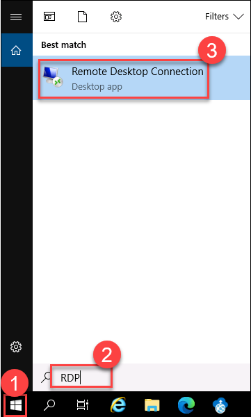
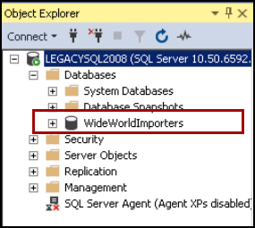
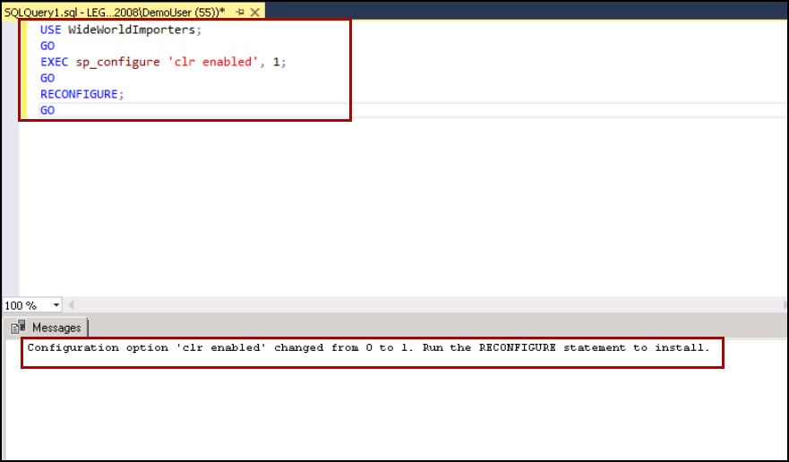

## Exercise 1: Review the on-prem database and enable CLR on the legacy server
Duration: 20 minutes

In this exercise, you will be accessing the already restored database inside the legacy server and will be enabling the CLR on legacy server.

### Task 1: Connect to the WideWorldImporters database on the legancysql2008 VM

1. On the JumpBox VM, in the search bar, **Search** for **RDP** and **select** the **Remote Desktop Connection** app.
   
   

1. Paste the **SQLVM DNS Name** in the **Computer** field and click on **Connect**.
   * **SQLVM DNS Name**: **<inject key="SQL Server VM DNS Name" />**

     
 
1. Now, enter the SQLVM **username**, and **password** provided below and then click on the **Ok** button. Please add the **dot** and **back-slash** “.\” before the username.
    - **Username**: **<inject key="SQL Server VM Username" />**
    - **Password**: **<inject key="SQL Server VM Password" />**
   
    

1. Next, click on the **Yes** button to accept the certificate and add in trusted certificates.

   

### Task 2: Connect to the Legacry server using SSMS.

1. Once logged in, open **Microsoft SQL Server Management Studio 17** (SSMS) by entering "sql server" in the search bar in the Windows Start menu and selecting **Microsoft SQL Server Management Studio 17** from the search results.

   

1. In the SSMS **Connect to Server** dialog, enter **LEGACYSQL2008** as the Server name, ensure **Windows Authentication** is selected, and then click on **Connect**.

   

1. Once connected, verify you see the `WideWorldImporters` database listed under databases.

    

### Task 3: Enable CLR on the legacy server.

1. In Microsoft SQL Server Management Studio, select **New Query** from the SSMS toolbar.

   
   
1. Next, copy and paste the SQL script below in a new query window. This script enables the Common Language Runtime in databases.

    ```sql
    USE WideWorldImporters;
    GO
    EXEC sp_configure 'clr enabled', 1;
    GO
    RECONFIGURE;
    GO
    ```

1. To run the script, select **Execute** from the SSMS toolbar.

   

1. The output will look like below

   
   
1. You have successfully enabled the CLR on the legacy server, now click on the Next button present in the bottom-right corner of this lab guide.

## Summary

In this exercise, you have connected to on-prem sql server, checked imported database, and enabled CLR in the server.

Click on the **Next** button present in the bottom-right corner of the lab guide to move next exercise of the lab.
   
