## Exercise 2: General post-setup tasks

### Task 1: Enable CLR on the SQL Managed Instance 

1. In Microsoft SQL Server Management Studio, select **New Query** from the SSMS toolbar.

    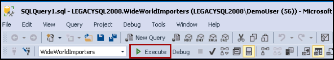
    
1. Next, copy and paste the SQL script below into the new query window. This script enable the Common Language Runtime on Managed Instance.

    ```sql
    EXEC sp_configure 'clr enabled', 1;
    GO
    RECONFIGURE;
    GO
    ```
1. To run the script, select **Execute** from the SSMS toolbar.

    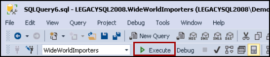
    
### Task 2: Prepare SSIS Demo

1. In the File Explorer dialog, navigate to the `C:\Labfiles` folder. In the `lab-files` folder, Right click on `ssis.ps1` powershell script and click on **Run with powershell**.
    
    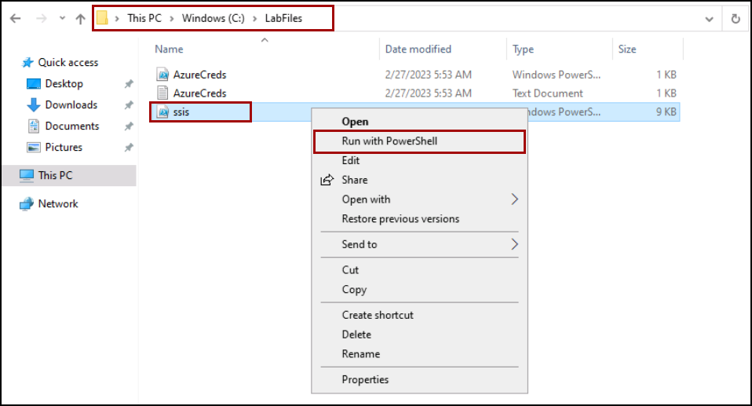
   
    
### Task 3: Create an Azure-SSIS integration runtime

1. Navigate to the [Azure portal](https://portal.azure.com), search and select **Data Factories** from the Azure search bar.

    

1. Select your **Data Factory**.

    
    
1. In the **Overview** section, Click on **Launch Studio**.

    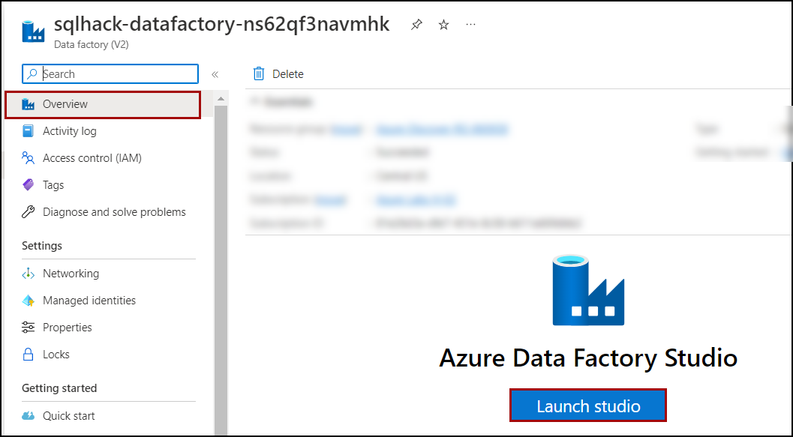

1. In the Azure Data Factory UI, switch to the **Manage** tab, and then switch to the **Integration runtimes** tab to view existing integration runtimes in your data factory.

    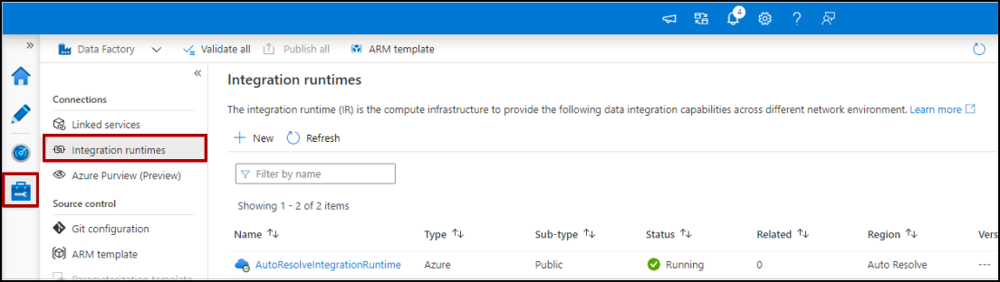
    
1. Click on the Manage icon->Integration Runtimes. Select SSISIR and click Start. If it cannot be started, delete the SSISIR integration runtime and follow the below steps to create a new SSIS integration runtime.

1. Select **New** to create an Azure-SSIS IR and open the Integration runtime setup pane.

    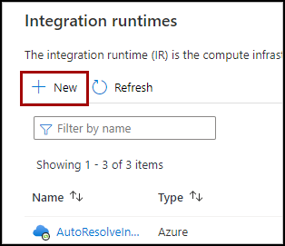

1. In the Integration runtime setup pane, select the **Lift-and-shift existing SSIS packages to execute in Azure tile**, and then select **Continue**.

    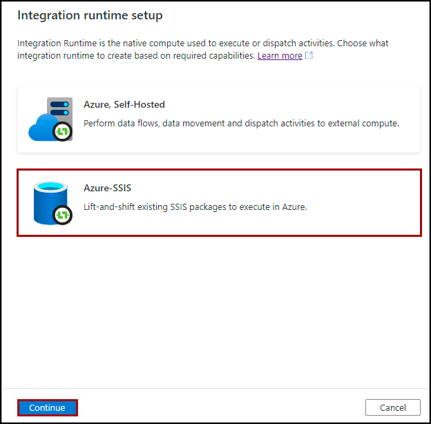
    
1. On the **General settings** page of Integration runtime setup pane, complete the following steps.

    - Enter Name : **SSISIR**
    - Location: **Central US**
    - Node Size: **D4_v3 (4 Core(s), 16384 MB)**
    - Node Number: **1**
    - Click on **Continue**.

    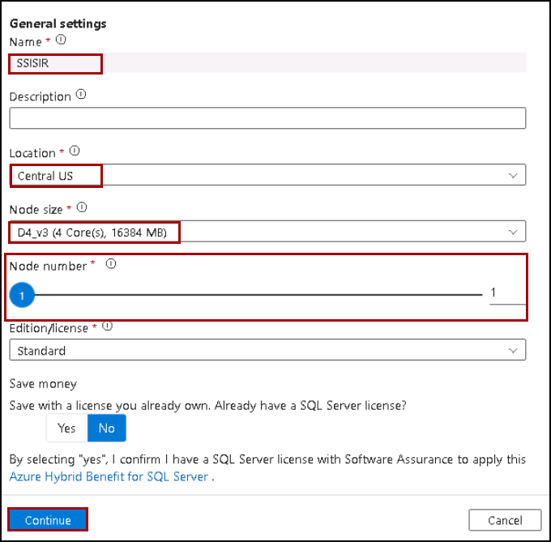
    
1. On the Deployment settings page of Integration runtime setup pane, you have the options to create **SSISDB**.

    - Enter Admin Username: **contosoadmin**
    - Enter Admin Password: **IAE5fAijit0w^rDM**
    - Click on **Continue**.
               
    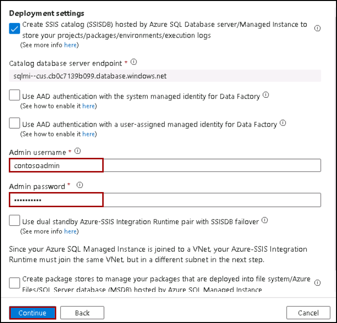
    
1. In the Advanced settings pane of the Integration runtime setup pane,

    - VNet Name: **vnet-sqlmi--cus**
    - Subnet name: **Management1**
    - Click on **VNet Validation**

    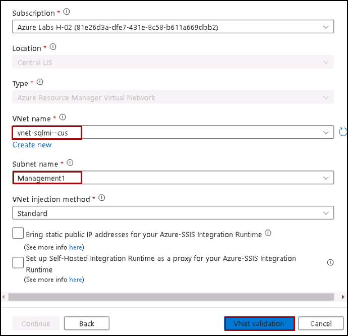
    
1. Click on **Continue**.

1. Leave it as default, and Click on **Create**.

    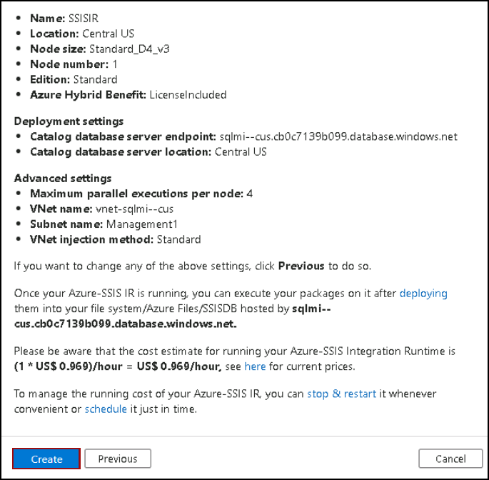

1. You will see that **SSISIR** integration runtime is in running status.

    
    
### Task 3: Review the Security of Microsoft Defender for Cloud.

1. Search and select **SQL Managed instance** from the Azure search bar.
    
    

1. Select your **Managed instance**.

    
    
1. Under the Security, select **Microsoft Defender for Cloud**.
    
    
    
1. At the top of the page click on the **Configure** link next to the Azure Defender for SQL: Enabled at the server-level header.

    
        
1. Under the VULNERABILITY ASSESSMENT SETTINGS, check your **Subscription** and check defender is linked to a **Storage account**.

    
    
    
    
    
    
    
    
    
    
    
    
    
    
    
    
    
    
    
    
    
    
    
    
    
    
    
    
    
    
    
    
    
    
    
    
    
    
    
    
    
    
    
    
    
    
    
    
    
    
    
