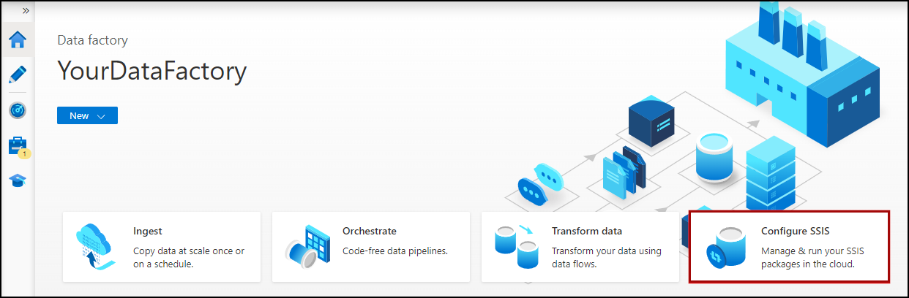
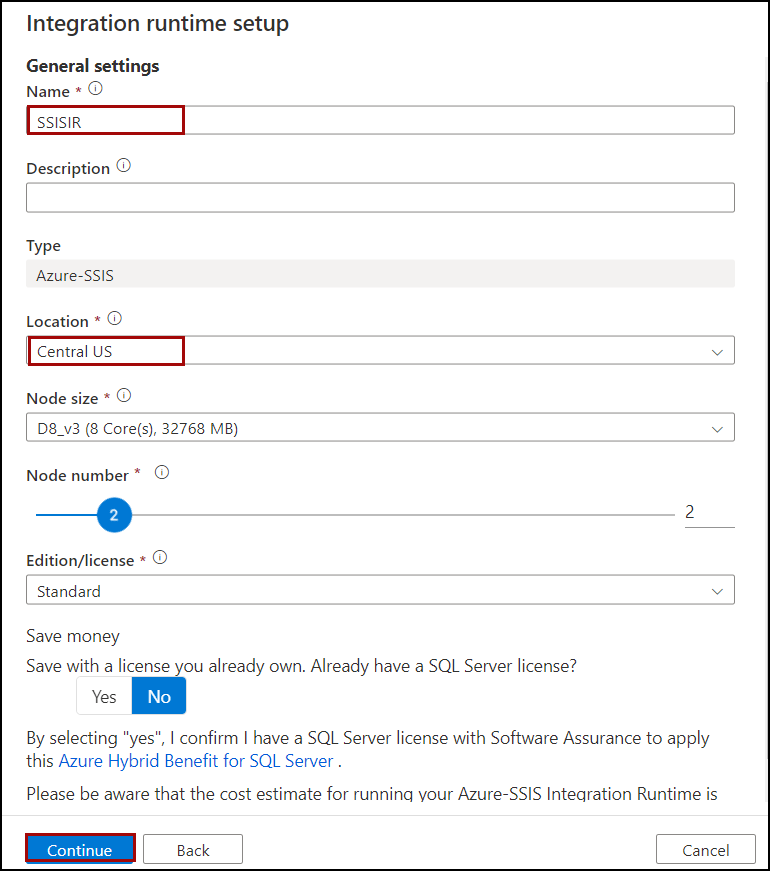
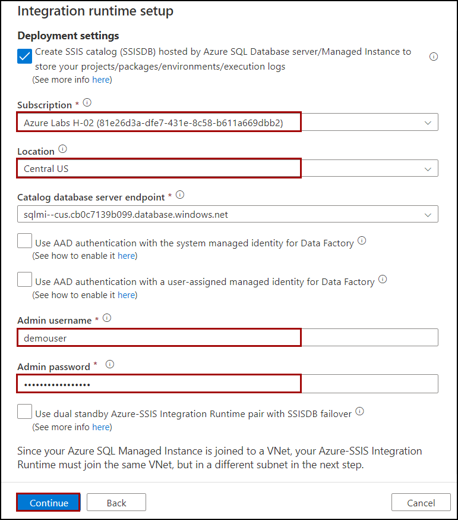
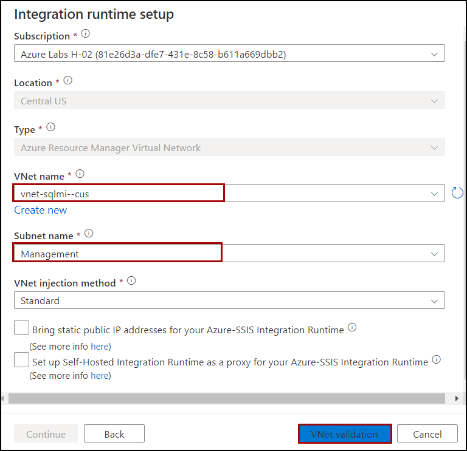

## Exercise 2: General post-setup tasks

### Task 2: Create an Azure-SSIS integration runtime

1. Navigate to the [Azure portal](https://portal.azure.com) and select **Data Factories** from the Azure services list.

    

1. Select your **Data Factory**.

    
    
1. In the **Overview** section, Click on **Launch Studio**.

    

1. On the home page, select the **Configure SSIS** tile.

    

1. In the Azure Data Factory UI, switch to the **Manage** tab, and then switch to the **Integration runtimes** tab to view existing integration runtimes in your data factory.

    

1. Select **New** to create an Azure-SSIS IR and open the Integration runtime setup pane.

    

1. In the Integration runtime setup pane, select the **Lift-and-shift existing SSIS packages to execute in Azure tile**, and then select **Continue**.

    
    
1. On the **General settings** page of Integration runtime setup pane, complete the following steps.

    - Enter Name : **SSISIR**.
    - Location: **Central US**.
    - Click on **Continue**.

    
    
1. On the Deployment settings page of Integration runtime setup pane, you have the options to create **SSISDB**.

    - Subscription: Check whatever you used to perform the steps.
    - Location: **Central US**
    - Enter Admin Username: **DemoUser**
    - Enter Admin Password: **Password.1234567890**
    - Click on **Continue**.
               
    
    
1. In the Advanced settings pane of the Integration runtime setup pane,

    - VNet Name: **vnet-sqlmi--cus**
    - Subnet name: **Management**
    - Click on **VNet Validation**

    
    
1. Click on **Continue**.

1. 
    
