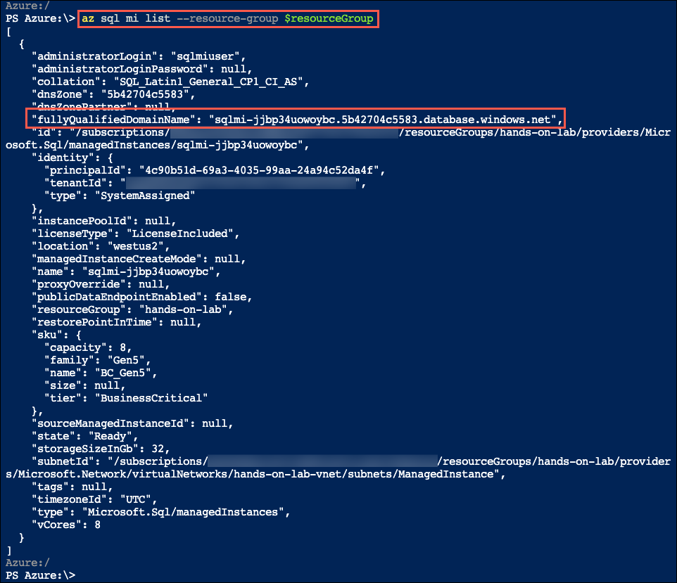
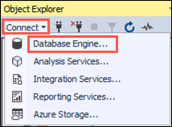
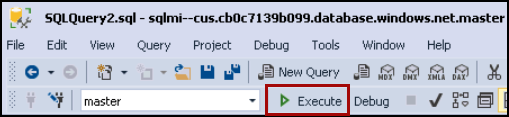
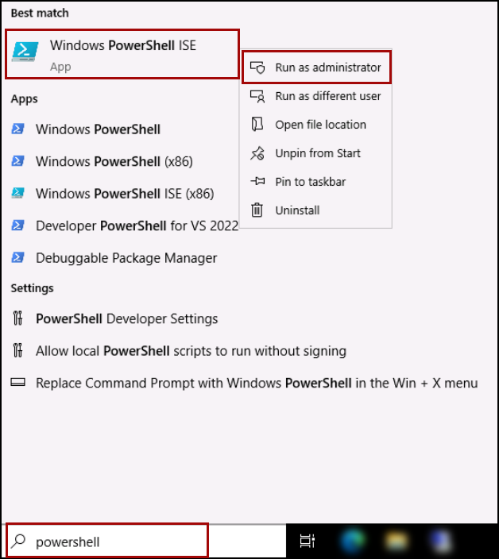

## Exercise 2: Migrate your on-premise SSIS using Azure Data Factory

### Task 1: Review the already Enabled CLR on the SQL Managed Instance

1. First, use the Azure Cloud Shell to retrieve the fully qualified domain name of your SQL MI database. In the Azure portal `https://portal.azure.com`, select the Azure Cloud Shell icon from the top menu.

   

1. In the Cloud Shell window that opens at the bottom of your browser window, select **PowerShell**.

   

1. In the You have no storage mounted, Click on  **Show advanced settings**. 

   

1. Provide the following details and click on **Create storage (4)**.

   - Resource group: **Azure-Discover-RG-<inject key="DeploymentID" enableCopy="false" /> (1)**
   - Storage account: **cloudshell<inject key="DeploymentID" enableCopy="false" /> (2)**
   - File share: **blob (3)**

   

1. After a moment, a message is displayed that you have successfully requested a Cloud Shell, and be presented with a PS Azure prompt.

   

1. At the prompt, retrieve information about SQL MI in the SQLMI-Shared-RG resource group by entering the following PowerShell command.

   ```powershell
   $resourceGroup = "SQLMI-Shared-RG"
   az sql mi list --resource-group $resourceGroup
   ```

   > **Note**
   >
   > If you have multiple Azure subscriptions, and the account you are using for this hands-on lab is not your default account, you may need to run `az account list --output table` at the Azure Cloud Shell prompt to output a list of your subscriptions. Copy the Subscription Id of the account you are using for this lab and then run `az account set --subscription <your-subscription-id>` to set the appropriate account for the Azure CLI commands.

1. Within the above command's output, locate and copy the value of the `fullyQualifiedDomainName` property. Paste the value into a text editor, such as Notepad.exe, for reference below.

   

1. Return to SSMS on your **legacysql2008** VM, and then select **Connect** and **Database Engine** from the Object Explorer menu.

   

1. In the Connect to Server dialog, enter the following:

   - **Server name**: Enter the fully qualified domain name of your SQL managed instance, which you copied from the Azure Cloud Shell in the previous steps.
   - **Authentication**: Select **SQL Server Authentication**.
   - **Login**: Enter `sqlmiuser`
   -  **Password**: Enter `Password.1234567890`
   - Check the **Remember password** box.

   

1. Select **Connect**. 

1. In Microsoft SQL Server Management Studio, select **New Query** from the SSMS toolbar.

    
    
1. Next, copy and paste the SQL script below into the new query window. This script verify that CLR is enabled for the manged instance.

    ```sql
    EXEC sp_configure 'clr enabled';
    GO
    ```
1. To run the script, select **Execute** from the SSMS toolbar.

    
    
1. The output should display the CLR is enabled for the manged instance.

   
    
### Task 2: Prepare SSIS Demo

1. Navigate back to Jumpboc, type **PowerShell** in the search bar, right-click on **Windows PowerShell ISE** and click on **Run as administrator** in the context menu.

   

1. If prompted, click **Yes** to allow the app to make changes to your device.

1. Click on **File** menu and then click on **Open** to open a powershell script.

   
   
1. Navigate to the `C:\Labfiles` folder, Click on **ssis.ps1** script and then click on **Open**. 
   
   
   
1. Click on **Run script**.

   
  
### Task 3: Create an Azure-SSIS integration runtime

1. Navigate to the [Azure portal](https://portal.azure.com), search and select **Data Factories** from the Azure search bar.

    

1. Select your **Data Factory**.

    
    
1. In the **Overview** section, Click on **Launch Studio**.

    

1. In the Azure Data Factory portal, switch to the **Manage** tab, and then switch to the **Integration runtimes** tab to view existing integration runtimes in your data factory.

    
    
    >**Note**: Select SSISIR and click Start. If it cannot be started, delete the SSISIR integration runtime and follow the below steps to create a new SSIS integration runtime.

1. Select **New** to create an Azure-SSIS IR and open the Integration runtime setup pane.

    

1. In the Integration runtime setup pane, select the **Lift-and-shift existing SSIS packages to execute in Azure tile**, and then select **Continue**.

    
    
1. On the **General settings** page of Integration runtime setup pane, complete the following steps.

    - Enter Name : **SSISIR**
    - Location: **Central US**
    - Node Size: **D2_v3 (2 Core(s), 8192 MB)**
    - Node Number: **1**
    - Click on **Continue**.

    
    
1. On the Deployment settings page of Integration runtime setup pane, you have the options to create **SSISDB**.

    - Enter Admin Username: `contosoadmin`
    - Enter Admin Password: `IAE5fAijit0w^rDM`
    - Click on **Continue**.
               
    
    
1. In the Advanced settings pane of the Integration runtime setup pane,

    - VNet Name: **vnet-sqlmi--cus**
    - Subnet name: **Management1**
    - Click on **VNet Validation**

    
    
1. Click on **Continue**.

1. Leave it as default, and Click on **Create**.

    

1. You will see that **SSISIR** integration runtime is in running status.

    
    

    
    
    
    
    
    
    
    
    
    
    
    
    
    
    
    
    
    
    
    
    
    
    
    
    
    
    
    
    
    
    
    
    
    
    
    
    
    
    
    
    
    
    
    
    
    
    
    
    
