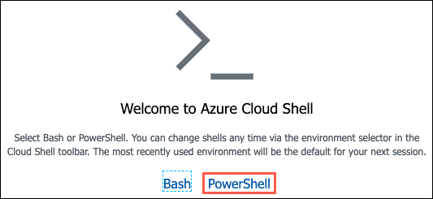
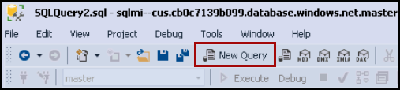
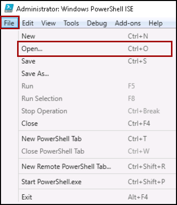
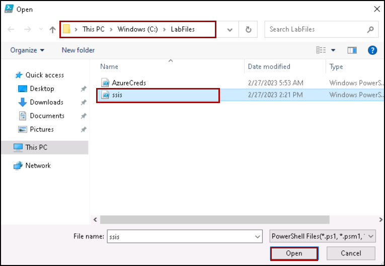

## Exercise 2: Migrate your on-premises SSIS using Azure Data Factory

### Task 1: Review the enabled CLR on the SQL Managed Instance

1. First, use the Azure Cloud Shell to retrieve the fully qualified domain name of your SQL MI database. In the Azure portal `https://portal.azure.com`, select the Azure Cloud Shell icon from the top menu.

   

1. In the Cloud Shell window that opens at the bottom of your browser window, select **PowerShell**.

   

1. In the You have no storage mounted, click on **Show advanced settings**.

   

1. Provide the following details and click on **Create storage (4)**.

   - Resource group: **Azure-Discover-RG-<inject key="DeploymentID" enableCopy="false" /> (1)**
   - Storage account: **cloudshell<inject key="DeploymentID" enableCopy="false" /> (2)**
   - File share: **blob (3)**

   

1. After a moment, a message is displayed that you have successfully requested a Cloudshell and be presented with a PS Azure prompt.
 
   

1. At the prompt, retrieve information about SQL MI in the SQLMI-Shared-RG resource group by entering the following PowerShell command.

   ```powershell
    $resourceGroup = "SQLMI-Shared-RG" az sql mi list --resource-group $resourceGroup
   ```

   >**Note**: If you have multiple Azure subscriptions, and the account you are using for this hands-on lab is not your default account, you may need to run `az account list --output table` at the Azure Cloud Shell prompt to output a list of your subscriptions. Copy the Subscription ID of the account you are using for this lab, and then run `az account set --subscription <your-subscription-id>` to set the appropriate account for the Azure CLI commands.

1. Within the above command's output, locate and copy the value of the `fullyQualifiedDomainName` property. Paste the value into a text editor, such as Notepad.exe, for reference below.

   

1. Return to SSMS on your **legacysql2008** VM, and then select **Connect** and **Database Engine** from the Object Explorer menu.

   

1. In the Connect to Server dialog, enter the following:

   - **Server name**: Enter the fully qualified domain name of your SQL managed instance, which you copied from the Azure Cloud Shell in the previous steps.
   - **Authentication**: Select **SQL Server Authentication**.
   - **Login**: Enter `contosoadmin`
   -  **Password**: Enter `IAE5fAijit0w^rDM`
   - Check the **Remember password** box.

   

1. Select **Connect**.

1. In Microsoft SQL Server Management Studio, select **New Query** from the SSMS toolbar.

   

1. Next, copy and paste the SQL script below into the new query window. This script verifies that CLR is enabled for the managed instance.

    ```sql
    EXEC sp_configure 'clr enabled';
    GO 
    ```

1. To run the script, select **Execute** from the SSMS toolbar.

   

1. The output should display the CLR is enabled for the manged instance.

   

### Task 2: Prepare SSIS Demo

1. Navigate back to JumpBox, type **PowerShell** in the search bar, right-click on **Windows PowerShell ISE** and click on **Run as administrator** in the context menu.

   

1. If prompted, click **Yes** to allow the app to make changes to your device.

1. Click on **File** menu and then click on **Open** to open a PowerShell script.

   

1. Navigate to the `C:\Labfiles` folder, click on **ssis.ps1** script and then click on **Open**.

   

1. Click on **Run script**.

   

### Task 3: Create an Azure-SSIS integration runtime

1. Navigate to the [Azure portal](https://portal.azure.com), search and select **Data Factories** from the Azure search bar.

   

1. Select your **Data Factory**.

   


1. In the **Overview** section, Click on **Launch Studio**.

   

1. In the Azure Data Factory portal, switch to the **Manage** tab, and then switch to the **Integration runtimes** tab to view existing integration runtimes in your data factory.

   

   >**Note**: Select SSISIR and click Start. If it cannot be started, delete the SSISIR integration runtime and follow the below steps to create a new SSIS integration runtime.

1. Select **New** to create an Azure-SSIS IR and open the Integration runtime setup pane.

   

1. In the Integration runtime setup pane, select the **Lift-and-shift existing SSIS packages to execute in Azure tile**, and then select **Continue**.

   

1. On the **General settings** page of the Integration runtime setup pane, complete the following steps.

   - Enter Name: **SSISIR**
   - Location: **Central US**
   - Node Size: **D2_v3 (2 Core(s), 8192 MB)**
   - Node Number: **1**
   - Click on **Continue**.

   

1. On the Deployment Settings page of the Integration Runtime Setup Pane, you have the options to create **SSISDB**.

   - Enter Admin Username: `contosoadmin`
   - Enter Admin Password: `IAE5fAijit0w^rDM`
   - Click on **Continue**.

   

1. In the Advanced settings pane of the Integration runtime setup pane,

   - VNet Name: **vnet-sqlmi--cus**
   - Subnet name: **Management1**
   - Click on **VNet Validation**

   

1. Click on **Continue**.

1. Leave it as default and click on **Create**.

   

1. You will see that the **SSISIR** integration runtime is in running status.
 
   

### Task 4: Upgrade the package using the Upgrade Wizard

In this section, we will be upgrading the Legacy SSIS package so that it can be migrated to Azure.

1. On the JumpBox VM, navigate to `C:\labfiles` and open **SSISDW.sln** in VS 2017

   

1. Once Visual Studio is open, you will see that the project is unsupported and visual studio will migrate the project automatically, click Ok to proceed.

   

1. Once the project is migrated, a new browser window will open and you should be able to see the migration report. You can review the report and close the tab.

   

1. Navigate back to Visual Studio and you should be able to see SSIS Package Upgrade Wizard.

   

1. Click on Next on the upgrade wizard, and on **Package management option** page select the below options and click on next.

   - Update connection strings to use new provider names.
   - Continue upgrade process when a package upgrade fails.
   - Ignore configurations.

   

1. Now review the information and click on the **Finish** button to complete the package upgrade wizard.

   

1. Once the upgrade is complete, you can click on the close button. You should be able to see the below output upon completion of the package upgrade process.

   

1. As soon as the solution is upgraded, you should be able to load the project without any issues.

   

### Task 5: Convert to Project Deployment mode and update the connection string

In this task, we will be converting the DTSX package into a Project Deployment model and correcting the DTSX package connection strings to use the new SQL Server Managed Instance using Visual Studio 2017.

1. Now click on the **PopulateDW.dtsx** and click OK on **Synchronise Connection Strings** to acknowledge the connection.

   

   

1. Now right click on the solution and click on **Convert to project deployment model** to convert the project.

   

1. Click on next until the end of the convert page and click on **convert** button to complete the project covert.

   

1. Review the summary of project covert and click on **close** to close the convert window.

   

1. Now double click on the **SQL Server** under connection manager windows.

   

1. On the **Connection Manager** window, select **Native ODL DB/SQL Server Native Client 11.0**  from the drop-down.

   

1. Now enter the below details for the target SQLMI as shown below:

   - Server Name: Enter the SQLMI FQDN noted from the previous task
   - Authentication: **SQL Server Authentication**
   - Username: `Contosoadmin`
   - Password: `IAE5fAijit0w^rDM`
   - Database Name: Select **2008DWSUFFIX** from the drop-down and click **ok**

   

1. Now right click on the **SQL Server** connect and click on **Convert to Project Connection**

   

1. Now you should be able to see a newly created connection under **connection manager** on solution explorer.

   

### Task 6: Deploy packages to the SSISDB on the Managed Instance

In this task, we will be deploying the fixed package onto the SSIS integration runtime and SSISDB held within the Managed Instance.

1. Right click on the solution and click on properties to change the target server type to 2017 as 2019 is not yet supported.

   

1. On the solution properties, select General under **Configuration Properties** and select **TargetServerVersion** as **SQL Server 2017** from drop-down menu and click on Apply and **ok**.

   

1. If you do get the "Do you want to reload" message, click **No to All**.

   

1. Now right click on the solution and click on **Deploy**.

   

1. Click on Next on the **Introduction** page on **Integration Services Deployment Wizard**

1. Click Next on the **Select source** page with default value.

   

1. On the **Deployment Target** page select **SSIS in Azure Data Factory** and click on Next.

   

1. Now, under **Destination** enter the below details and click on **Connect**.

   - Server Name: Enter the SQLMI FQDN noted from the previous task
   - Authentication: **SQL Server Authentication**
   - Username: **Contosoadmin**
   - Password: **IAE5fAijit0w^rDM**
   - Path: **/SSISDB/demo/SSISDW**

   

1. Review the values and click on **Deploy** button to start the project deployment.

   

### Task 7:  Verify Deployment and Test-Run Package

1. 
