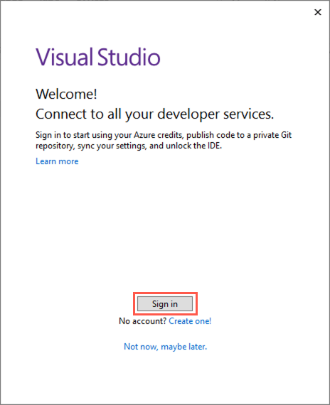
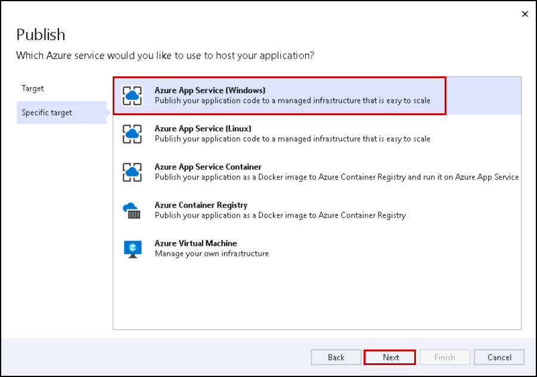
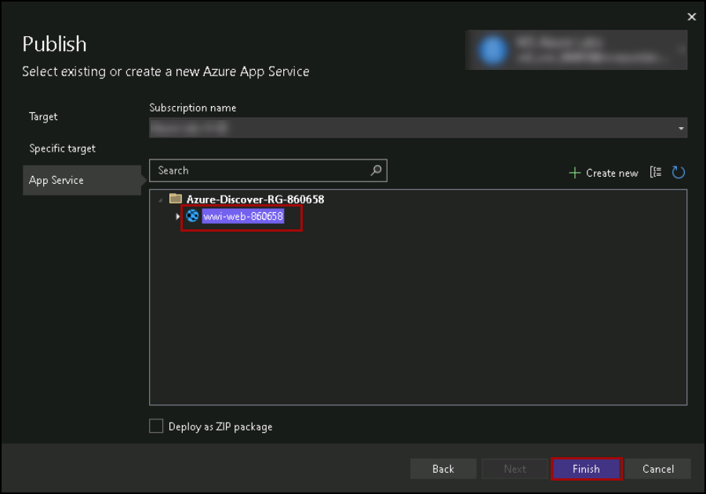

## Exercise 3: Check and update team VMs

### Task 1: Check databases 

1. Navigate to the [Azure portal](https://portal.azure.com) and select **Resource groups** from the Azure services list.

   

1. Select the resource group from the list.

   

1. In the list of resources for your resource group, select the **legacysql2008** VM.

   

1. On the VM blade in the Azure portal, select **Overview** from the left-hand menu, and then select **Connect** and **RDP** on the top menu, as you've done previously.

   

1. On the Connect with RDP blade, select **Download RDP File**, then open the downloaded RDP file.

1. Select **Connect** on the Remote Desktop Connection dialog.

   

1. Enter the following credentials when prompted, and then select **OK**:

   - **Username**: `DemoUser`
   - **Password**: `Password.1234567890`

   

1. Select **Yes** to connect if prompted that the remote computer's identity cannot be verified.

   
   
1. Once logged in, open **Microsoft SQL Server Management Studio 17** (SSMS) by entering "sql server" into the search bar in the Windows Start menu and selecting **Microsoft SQL Server Management Studio 17** from the search results.

   

1. In the SSMS **Connect to Server** dialog, enter LEGACYSQL2008 into the Server name box, ensure **Windows Authentication** is selected, and then select **Connect**.
  
    
    
1. Right click on the SQL sever and then click on **New Query**.

    

1. Next, copy and paste the SQL script below into the new query window and run this TSQL to check tables exists that they have data and click on **Execute**.

    ```sql
   DECLARE @cmd varchar(500) 
   SET @cmd='
	 IF "?" LIKE "%TenantDataDb"
	 BEGIN
	 USE ?
	 select DB_Name(), ''SalesLT.Customer'', count(*) from SalesLT.Customer;
	 select DB_Name(), ''SalesLT.Product'', count(*) from SalesLT.Product;
	 END' 
   EXEC sp_MSforeachdb @cmd;
    ```
   
   
   
### Task 2: Deploy the web app to Azure

In this task, you will use JumpBox VM and then, using Visual Studio on the JumpBox, deploy the `WideWorldImporters` web application into the App Service in Azure.

1. You have already logged-in to JumpBox VM, use this VM to continue with the lab. 

1. In the File Explorer dialog, navigate to the `C:\hands-on-lab` folder and then drill down to `Migrating-SQL-databases-to-Azure-master\Hands-on lab\lab-files`. In the `lab-files` folder, double-click `WideWorldImporters.sln` to open the solution in Visual Studio.

   

1. If prompted about how you want to open the file, select **Visual Studio 2022**, and then select **OK**.

    

1. Select **Sign in** and enter the following Azure account credentials when prompted:
   * Email/Username: <inject key="AzureAdUserEmail"></inject>
   * Password: <inject key="AzureAdUserPassword"></inject>

    

1. At the security warning prompt, uncheck **Ask me for every project in this solution**, and then select **OK**.

    

1. Once logged into Visual Studio, right-click the `WideWorldImporters.Web` project in the Solution Explorer, and then select **Publish**.

    

1. On the **Publish** dialog, select **Azure** in the Target box, and select **Next**.

    

1. Next, in the **Specific target** box, select **Azure App Service (Windows)**.

    

1. Finally, in the **App Service** box, select your subscription, expand the **hands-on-lab-<inject key="Suffix" enableCopy="false"/>** resource group, and select the **wwi-web-<inject key="Suffix" enableCopy="false"/>** Web App, Click on **Finish**.

    

1. Back on the Visual Studio Publish page for the `WideWorldImporters.Web` project, select **Publish** to start the process of publishing your Web API to your Azure API App.

    

1. When the publish completes, you will see a message on the Visual Studio Output page that the publish succeeded.

    

2. If you select the link of the published web app from the Visual Studio output window, an error page is returned because the database connection strings have not been updated to point to the SQL MI database. You address this in the next task.

    

### Task 3: Update App Service configuration

In this task, you update the WWI gamer info web application to connect to and utilize the SQL MI database.

1. In the Azure portal `https://portal.azure.com`, select **Resource groups** from the Azure services list.

   

2. Select the <inject key="Resource Group Name" enableCopy="false"/> resource group from the list.

   

3. In the list of resources for your resource group, select the **<inject key="Resource Group Name" enableCopy="false"/>** resource group and then select the **wwi-web-<inject key="Suffix" enableCopy="false"/>** App Service from the list of resources.

   

4. On the App Service blade, select **Configuration** under Settings on the left-hand side.

   

5. On the Configuration blade, locate the **Connection strings** section and then select the Pencil (Edit) icon to the right of the `WwiContext` connection string.

   

6. The value of the connection string should look like this:

    
  ``
  Server=tcp:your-sqlmi-host-fqdn-value,1433;Database=WideWorldImportersSuffix;User ID=contosoadmin;Password=IAE5fAijit0w^rDM;Trusted_Connection=False;Encrypt=True;TrustServerCertificate=True;
   ``
   

7. In the Add/Edit connection string dialog, replace `your-sqlmi-host-fqdn-value` with the fully qualified domain name for your SQL MI that you copied to a text editor earlier from the Azure Cloud Shell and replace suffix with value: <inject key="suffix" /> .

   

8. The updated value should look similar to the following screenshot.

   

9. Select **OK**.

10. Repeat steps 3 - 7, this time for the `WwiReadOnlyContext` connection string.

11. Select **Save** at the top of the Configuration blade.

    

12. When prompted that changes to application settings and connection strings will restart your application, select **Continue**.

    

13. Select **Overview** to the left of the Configuration blade to return to the overview blade of your App Service.

    

14. At this point, selecting the **URL** for the App Service on the Overview blade still results in an error being returned. The error occurs because SQL Managed Instance has a private IP address in its VNet. To connect an application, you need to configure access to the VNet where Managed Instance is deployed, which you handle in the next exercise.

    

### Task 4: Configure VNet integration with App Services

In this task, you add the networking configuration to your App Service to enable communication with resources in the VNet.

1. In the Azure portal `https://portal.azure.com`, select **Resource groups** from the left-hand menu, select the **<inject key="Resource Group Name" enableCopy="false"/>** resource group and then select the **wwi-web-UNIQUEID** App Service from the list of resources.

   

2. On the App Service blade, select **Networking** from the left-hand menu.

   

3. On the **Networking** page, click on the **VNet integration** within **Outbound Traffic**.

   

3. Now select **Click here to configure** under **VNet Integration** and then click on **Add VNet** on the VNet Configuration blade.

   

4. On the Network Feature Status dialog, enter the following and click **OK**.

   - **Virtual Network**: Select the vnet-sqlmi--cus.
   - **Subnet**: Select the existing subnet. and select any subnet from the drop down menu. 
      

   		> **Note**: If you see **Failed to add delegation to existing subnet** please select any other subnet.


  		> **Note**: If you are not able to select any existing subnet, then follow the below steps.
   - Select the create new subnet option and enter name as Webappsubnet<inject key="Suffix" />. Select the Virtual Network address block i.e, 10.0.0.0/16 from the drop down list. In the subnet address block enter new address block 10.0.xx.0/23 for the subnet, make sure it is not overlapping other subnet's address.
 	 	> **Note**: If the address space is overlapping with other subnets, change the virtual network address block by selecting a different virtual network address block i.e, 10.1.0.0/16 or 10.2.0.0/16 from the drop-down. In the subnet address block, enter 10.1.xx.0/23 or 10.2.xx.0/23 according to the virtual network address block you have selected and make sure it is not overlapping the other subnet's address.

   		

5. Within a few minutes, the VNet is added, and your App Service is restarted to apply the changes. Select Refresh to confirm whether the Vnet is connected or not.

   

   > **Note**
   >
   > If you receive a message adding the Virtual Network to Web App failed, select **Disconnect** on the VNet Configuration blade, and repeat steps 3 - 5 above.

### Task 5: Open the web application

In this task, you verify your web application now loads, and you can see the home page of the web app.

1. Select **Overview** in the left-hand menu of your App Service and select the **URL** of your App service to launch the website. This link opens the URL in a browser window.

   

2. Verify that the website and data are loaded correctly. The page should look similar to the following:

   

   > **Note**
   >
   > It can often take several minutes for the network configuration to be reflected in the web app. If you get an error screen, try selecting Refresh a few times in the browser window. If that does not work, try selecting **Restart** on the Azure Web App's toolbar.

3. Congratulations, you successfully connected your application to the new SQL MI database.

