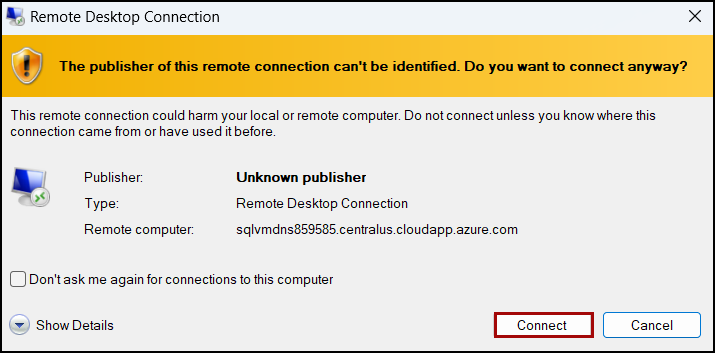
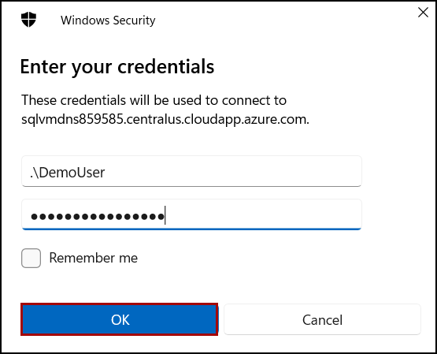
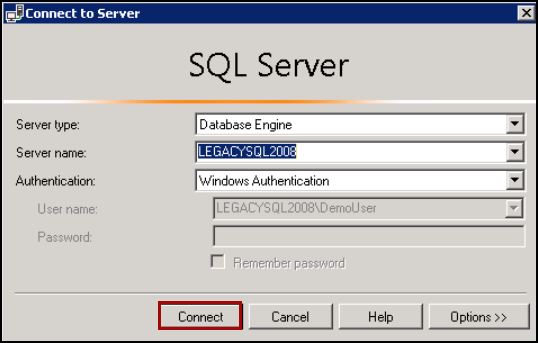
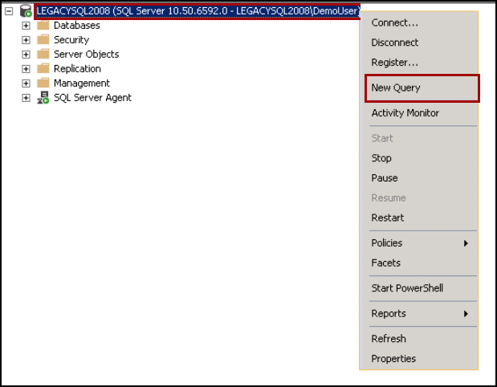
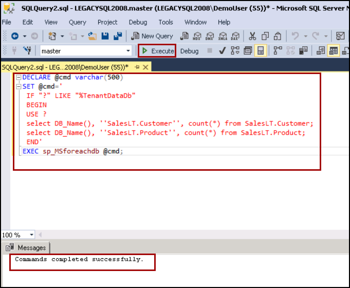

## Exercise 3: Check and update team VMs

### Task 1: Check databases 

1. Navigate to the [Azure portal](https://portal.azure.com) and select **Resource groups** from the Azure services list.

   

1. Select the resource group from the list.

   

1. In the list of resources for your resource group, select the **legacysql2008** VM.

   

1. On the VM blade in the Azure portal, select **Overview** from the left-hand menu, and then select **Connect** and **RDP** on the top menu, as you've done previously.

   

1. On the Connect with RDP blade, select **Download RDP File**, then open the downloaded RDP file.

1. Select **Connect** on the Remote Desktop Connection dialog.

   

1. Enter the following credentials when prompted, and then select **OK**:

   - **Username**: `DemoUser`
   - **Password**: `Password.1234567890`

   

1. Select **Yes** to connect if prompted that the remote computer's identity cannot be verified.

   
   
1. Once logged in, open **Microsoft SQL Server Management Studio 17** (SSMS) by entering "sql server" into the search bar in the Windows Start menu and selecting **Microsoft SQL Server Management Studio 17** from the search results.

   

1. In the SSMS **Connect to Server** dialog, enter LEGACYSQL2008 into the Server name box, ensure **Windows Authentication** is selected, and then select **Connect**.
  
    
    
1. Right click on the SQL sever and then click on **New Query**.

    

1. Next, copy and paste the SQL script below into the new query window and run this TSQL to check tables exists that they have data and click on **Execute**.

    ```sql
   DECLARE @cmd varchar(500) 
   SET @cmd='
	 IF "?" LIKE "%TenantDataDb"
	 BEGIN
	 USE ?
	 select DB_Name(), ''SalesLT.Customer'', count(*) from SalesLT.Customer;
	 select DB_Name(), ''SalesLT.Product'', count(*) from SalesLT.Product;
	 END' 
   EXEC sp_MSforeachdb @cmd;
    ```
   
