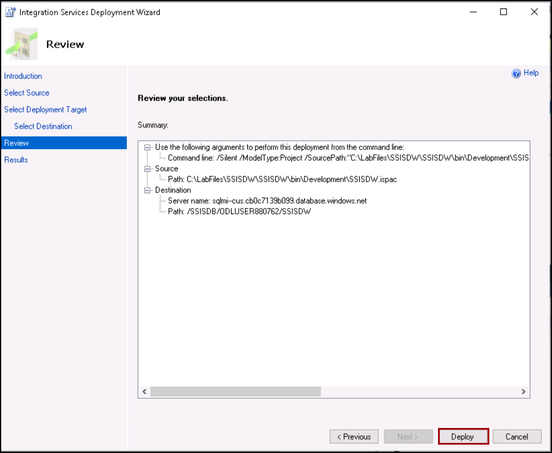

## Exercise 3: Migrate your on-premises SSIS packages using Azure Data Factory
Duration: 90 minutes

Now that the databases for the Tailspin Application have been migrated, there is a set of additional SSIS packages on the LEGACYSQL2008 server that also require migration to the SQL Managed Instance for the central Data Warehouse. In this exercise you will migrating the SSIS packages to SQLMi using SSDT tools and Azure data factory SSIS integration runtime. 

### Task 1: Review the already enabled CLR on the SQL Managed Instance

1. On the legacysql2008 VM, Open Microsoft SQL Server Management Studio, click on **New Query** from the SSMS toolbar.

   

1. Next, copy and paste the SQL script below into the new query window. This script verifies that CLR is enabled for the managed instance.

    ```sql
    EXEC sp_configure 'clr enabled';
    GO 
    ```

1. To run the script, select **Execute** from the SSMS toolbar.

   

1. The output should display the CLR is enabled for the manged instance.

   
   

### Task 2: Prepare SSIS Demo

In this task, you will be running a powershell script that will restore a SSIS packages DB into the SQLMI and install the required SSIS tool for the package migration. 

1. Navigate back to JumpBox, type **PowerShell** in the search bar, right-click on **Windows PowerShell ISE** and click on **Run as administrator** in the context menu.

   

1. If prompted, click **Yes** to allow the app to make changes to your device.

1. Click on **File** menu and then click on **Open** to open a PowerShell script.

   

1. Navigate to the `C:\Labfiles` folder, click on **ssis.ps1** script and then click on **Open**.

   

1. Click on **Run script**.  
   
1. While the script is running, you will see a new SSIS packges install window, click on **Modify** button to configure the SSIS installation on the server.

     
    
1. On the next window, select the checkbox on **SQL Server Integration Services** tool and click on **Modify**. This will install the SSIS tool on the server, once the installation is completed you can close the window.

   

 

### Task 3: Review the already created Azure-SSIS integration runtime.  

1. Navigate to the Azure portal, search and select **data factories** from the Azure search bar.

   

1. Select your **Data Factory** names as **Data-Factory-Shared**.

   

1. In the **Overview** section, Click on **Launch Studio**.

   

1. In the Azure Data Factory portal, switch to the **Monitor** tab, and then select the **Integration runtimes** tab to view existing integration runtimes in your data factory.

   

1. You will see that the **SSISIR** integration runtime is in running status.
 
   
  
1. If the SSISIR integration runtime is in stopped state, click on **ellipsis** button and then click on **Start**.

### Task 4: Upgrade the package using the Upgrade Wizard

In this section, we will be upgrading the Legacy SSIS package so that it can be migrated to Azure.

1. On the JumpBox VM, navigate to `C:\Labfiles\SSISDW` and open **SSISDW.sln** in VS 2017

   

   >**Note**: Incase if sign-in prompt appears, Select **Sign in** and enter the following Azure account credentials when prompted:

   * Email/Username: <inject key="AzureAdUserEmail"></inject>
   * Password: <inject key="AzureAdUserPassword"></inject>   

1. Once Visual Studio is open, you will see that the project is unsupported and visual studio will migrate the project automatically, click Ok to proceed.

   

1. Once the project is migrated, a new browser window will open and you should be able to see the migration report. You can review the report and close the tab.

   

1. Navigate back to Visual Studio and you should be able to see SSIS Package Upgrade Wizard.

   

1. Click on Next on the upgrade wizard, and on **Package management option** page select the below options and click on next.

   - Update connection strings to use new provider names.
   - Continue upgrade process when a package upgrade fails.
   - Ignore configurations.

   

1. Now review the information and click on the **Finish** button to complete the package upgrade wizard.

   

1. Once the upgrade is complete, you can click on the close button. You should be able to see the below output upon completion of the package upgrade process.

   

1. As soon as the solution is upgraded, you should be able to load the project without any issues.

   

### Task 5: Convert to Project Deployment mode and update the connection string

In this task, we will be converting the DTSX package into a Project Deployment model and correcting the DTSX package connection strings to use the new SQL Server Managed Instance using Visual Studio 2017.

1. Now click on the **PopulateDW.dtsx** and click OK on **Synchronise Connection Strings** to acknowledge the connection.

   

   

1. Now right click on the solution and click on **Convert to project deployment model** to convert the project.

   

1. Click on **next** button till you get on convert page and click on **convert** button to complete the project covert.

   

1. Review the summary of project covert and click on **close** to close the convert window.

   

1. Now double click on the **SQL Server** under connection manager windows.

   

1. On the **Connection Manager** window, select **Native ODL DB/SQL Server Native Client 11.0**  from the drop-down.

   

1. Now enter the below details for the target SQLMI as shown below:

   - Server Name: Enter the SQLMI FQDN noted from the previous task
   - Authentication: **SQL Server Authentication**
   - **User name**: **<inject key="SQL MI Username" />**
   - **Password**: **<inject key="SQL MI Password" />** 
   - Database Name: Select **2008DW** from the drop-down and click **OK**

   

1. Now right click on the **SQL Server** connect and click on **Convert to Project Connection**

   

1. Now you should be able to see a newly created connection under **connection manager** on solution explorer.

   

### Task 6: Deploy packages to the SSISDB on the Managed Instance

In this task, we will be deploying the fixed package onto the SSIS integration runtime and SSISDB held within the Managed Instance.

1. Right click on the solution and click on properties to change the target server type to 2017 as 2019 is not yet supported.

   

1. On the solution properties, select General under **Configuration Properties** and select **TargetServerVersion** as **SQL Server 2017** from drop-down menu and click on Apply and **OK**.

   

1. If you do get the "Do you want to reload" message, click **No to All**.

   

1. Now right click on the solution and click on **Deploy**.

   

1. Click on Next on the **Introduction** page on **Integration Services Deployment Wizard**

1. Click Next on the **Select source** page with default value.

   

1. On the **Deployment Target** page select **SSIS in Azure Data Factory** and click on Next.

   

1. Now, under **Destination** enter the below details.

   - Server Name: Enter the SQLMI FQDN noted from the previous task
   - Authentication: **SQL Server Authentication** 
   - **User name**: **<inject key="SQL MI Username" />**
   - **Password**: **<inject key="SQL MI Password" />**
   - Click on **Connect**.

      
   
1. For Path, click on **Browse** and create a folder name as **ODLUSER<inject key="SUFFIX" enableCopy="false" />**, click on **OK**.

    

1. Review the values and click on **Deploy** button to start the project deployment.

   
   
1. Once the Results is passed, click on **Close**.

   
   
1. On your **JumpBox** VM, Open **Microsoft SQL Server Management Studio 17** from the Start menu and enter the following information in the **Connect to Server** dialog

   - **Server name**: Enter the fully qualified domain name of your SQL managed instance, which you copied from the Azure Cloud Shell in a previous Exercise.
   - **Authentication**: Select **SQL Server Authentication**.
   - **Login**: **<inject key="SQL MI Username" />**
   - **Password**: **<inject key="SQL MI Password" />** 
   - Check the **Remember password** box.
   - Click on **Options**

   
   
1. Under the Connection Properties, change the connect to database as **SSISDB** and click on **Connect**.
   
   
   
1. Navigate to the Integration Services Catalogs, you will see that under projects SSISDW is listed here.

   

1. Congratulations, you successfully migrated your SSIS packages to the Azure SQLMI database, now click on the Next button present in the bottom-right corner of this lab guide.


## Summary

In this exercise, you have Migrated you SSIS packges to the Azure SQLMI using Azure data factory.

