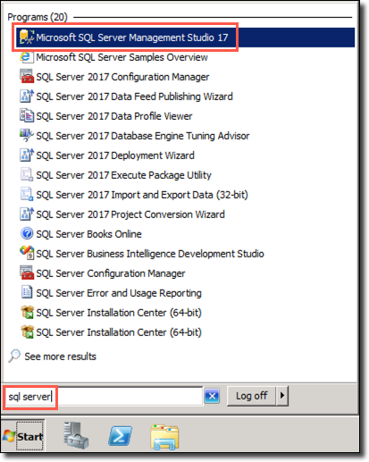

## Exercise 3: Test the Sample App

In this exercise, you use the **Azure Database Migration Service** here `https://azure.microsoft.com/services/database-migration/` (DMS) to migrate the `WideWorldImporters` database from an on-premises SQL Server 2008 R2 database into Azure SQL Managed Instance (SQL MI). WWI mentioned the importance of their gamer information web application in driving revenue, so for this migration, the online migration option is used to minimize downtime. Targeting the **Business Critical service tier** here `https://docs.microsoft.com/azure/azure-sql/managed-instance/sql-managed-instance-paas-overview#managed-instance-service-tiers` allows WWI to meet its customer's high-availability requirements.

> The Business Critical service tier is designed for business applications with the highest performance and high-availability (HA) requirements. To learn more, read the Managed Instance service tiers documentation.

### Task 1: Create an SMB network share on the LEGACYSQL2008 VM

In this task, you create a new SMB network share on the legacysql2008 VM. DMS uses this shared folder for retrieving backups of the `WideWorldImporters` database during the database migration process.

1. On the LEGACYSQL2008 VM, open **Windows Explorer** by selecting its icon on the Windows Taskbar.

   

2. In the Windows Explorer window, expand **Computer** in the tree view, select **Windows (C:)**, and then select **New folder** in the top menu.

   

3. Name the new folder **dms-backups**, then right-click the folder and select **Share with** and **Specific people** in the context menu.

   

4. In the File Sharing dialog, ensure the **DemoUser** is listed with a **Read/Write** permission level, and then select **Share**.

   

5. In the **Network discovery and file sharing** dialog, select the default value of **No, make the network that I am connected to a private network**.

   

6. Back on the File Sharing dialog, note the shared folder's path, ```\\LEGACYSQL2008\dms-backups```, and select **Done** to complete the sharing process.

   

### Task 2: Change MSSQLSERVER service to run under sqlmiuser account

In this task, you use the SQL Server Configuration Manager to update the service account used by the SQL Server (MSSQLSERVER) service to the `DemoUser` account. Changing the account used for this service ensures it has the appropriate permissions to write backups to the shared folder.

1. On your LEGACYSQL2008 VM, select the **Start menu**, enter "sql configuration" into the search bar, and then select **SQL Server Configuration Manager** from the search results.

   

   > **Note**
   >
   > Be sure to choose **SQL Server Configuration Manager**, and not **SQL Server 2017 Configuration Manager**, which does not work for the installed SQL Server 2008 R2 database.

2. In the SQL Server Configuration Managed dialog, select **SQL Server Services** from the tree view on the left, then right-click **SQL Server (MSSQLSERVER)** in the list of services and select **Properties** from the context menu.

   

3. In the SQL Server (MSSQLSERVER) Properties dialog, select **This account** under Log on as, and enter the following:

   - **Account name**: `DemoUser`
   - **Password**: `Password.1234567890`

    Properties")

4. Select **OK**.

5. Select **Yes** in the Confirm Account Change dialog.

   

6. Observe that the **Log On As** value for the SQL Server (MSSQLSERVER) service changed to `.\demouser`.

   

7. Close the SQL Server Configuration Manager.

### Task 3: Create a backup of the WideWorldImporters database

To perform online data migrations, DMS looks for database and transaction log backups in the shared SMB backup folder on the source database server. In this task, you create a backup of the `WideWorldImporters` database using SSMS and write it to the ```\\SQL2008-SUFFIX\dms-backups``` SMB network share you made in a previous task. The backup file needs to include a checksum, so you add that during the backup steps.

>**Note**: If you already connected with SSMS through legacysql2008 VM skip the steps and continue from step 3.

1. On the LEGACYSQL2008 VM, open **Microsoft SQL Server Management Studio 17** by entering "sql server" into the search bar in the Windows Start menu.

   

2. In the SSMS **Connect to Server** dialog, enter **legacysql2008** into the Server name box, ensure **Windows Authentication** is selected, and then select **Connect**.
   
    
   

3. Once connected, expand **Databases** under **LEGACYSQL2008** in the Object Explorer, and then right-click the **WideWorldImporters** database. In the context menu, select **Tasks** and then **Back Up**.

   

4. In the Back Up Database dialog, you should see `C:\WideWorldImporters.bak` listed in the Destinations box. This device is no longer needed, so select it and then select **Remove**.

   

5. Next, select **Add** to add the SMB network share as a backup destination.

   

6. In the Select Backup Destination dialog, select the Browse (`...`) button.

   

7. In the Location Database Files dialog, select the `C:\dms-backups` folder, enter `WideWorldImporters.bak` into the File name field, and then select **OK**.

   

8. Select **OK** to close the Select Backup Destination dialog.

   

9. In the Back Up Database dialog, select **Media Options** in the Select a page pane, and then set the following:

   - Select **Back up to the existing media set** and then select **Overwrite all existing backup sets**.
   - Under Reliability, check the box for **Perform checksum before writing to media**. A checksum is required by DMS when using the backup to restore the database to SQL MI.

   

10. Select **OK** to perform the backup.

11. You will receive a message when the backup is complete. Select **OK**.

    

### Task 4: Retrieve SQL MI and SQL Server 2008 VM connection information

In this task, you use the Azure Cloud shell to retrieve the information necessary to connect to your legacysql2008 VM from DMS.

1. In the Azure portal `https://portal.azure.com`, select the Azure Cloud Shell icon from the top menu.

   

2. In the Cloud Shell window that opens at the bottom of your browser window, select **PowerShell**.

   


5. At the prompt, retrieve the private IP address of the LEGACYSQL2008 VM. This IP address will be used to connect to the database on that server. Enter the following PowerShell command, **replacing `<your-resource-group-name>`** in the resource group name variable with the name of your resource group: Azure-Discover-RG-<inject key="DeploymentID" enableCopy="false" /> and vm name with: LEGACYSQL2008. 


      ```powershell
      $resourceGroup = "<your-resource-group-name>"
      az vm list-ip-addresses -g $resourceGroup -n VMNAME --output table
      ```

   > **Note**
   > Copy the powershell command in a notepad file and make the required changes and paste it in the cloud shell pane for convenience.
   
   > If you have multiple Azure subscriptions, and the account you are using for this hands-on lab is not your default account, you may need to run `az account list --output table` at the Azure Cloud Shell prompt to output a list of your subscriptions, then copy the Subscription Id of the account you are using for this lab and then run `az account set --subscription <your-subscription-id>` to set the appropriate account for the Azure CLI commands.

6. Within the output, locate and copy the value of the `ipAddress` property below the `PrivateIPAddresses` field. Paste the value into a text editor, such as Notepad.exe, for later reference.

    

7. Leave the Azure Cloud Shell open for the next task.

### Task 5: Create and run an online data migration project

In this task, you create a new online data migration project in DMS for the `WideWorldImporters` database.

1. In the Azure portal `https://portal.azure.com`, navigate to the Azure Database Migration Service by selecting **Resource groups** from the left-hand navigation menu, selecting the **Azure-Discover-RG-<inject key="DeploymentID" enableCopy="false" />**  resource group, and then selecting the **wwi-dms** Azure Database Migration Service in the list of resources.

   

2. On the Azure Database Migration Service blade, select **+New Migration Project**.

   

3. On the New migration project blade, enter the following:

   - **Project name**: Enter `OnPremToSqlMi`**(1)**
   - **Source server type**: Select **SQL Server**.
   - **Target server type**: Select **Azure SQL Database Managed Instance (2)**.
   - **Choose type of activity**: Select **Online data migration (3)**.

      

4. Select **Create and run activity (4)**.

5. On the Migration Wizard **Select source** tab, enter the following:

   - **Source SQL Server instance name**: Enter the IP address of your LEGACYSQL2008 VM that you copied into a text editor in the previous task. For example, `10.0.236.0`.
   - **Authentication type**: Select SQL Authentication.
   - **Username**: Enter `DemoUser`
   - **Password**: Enter `Password.1234567890`
   - **Connection properties**: Check both Encrypt connection and Trust server certificate.

   

6. Select **Next : Select target**.

7. On the Migration Wizard **Select target** tab, enter the following:

   - **Application ID**: <inject key="Application/Client ID" />
   - **Key**:  <inject key="Application Secret Key" />
   - **Skip the Application ID Contributor level access check on the subscription**: Leave this unchecked.
   - **Subscription**: Select the subscription you are using for this hand-on lab.
   - **Target Azure SQL Managed Instance**: Select the sqlmi--cus instance.
   - **SQL Username**: Enter `contosoadmin`
   - **Password**: Enter `IAE5fAijit0w^rDM`

   
   
8. Select **Next : Select databases**.

9. On the Migration Wizard **Select databases** tab, select `WideWorldImporters`.

   

10. Select **Next : Configure migration settings**.

11. On the Migration Wizard **Configure migration settings** tab, enter the following configuration:

    - **Network share location**: Populate this field with the path to the SMB network share you created previously by entering ```\\private ip adress\dms-backups```.
    - **Windows User Azure Database Migration Service impersonates to upload files to Azure Storage**: Enter ```LEGACYSQL2008\demouser```.
    - **Password**: Enter `Password.1234567890`
    - **Subscription containing storage account**: Select the subscription you are using for this hands-on lab.
    - **Storage account**: Select the **sqlmistore** storage account.

      
 
    - Click on **Advance Settings**. 
    - **WideWorldImporters**: Enter **WideWorldImporters-DID** 

 
         

12. Select **Next : Summary**.

13. On the Migration Wizard **Summary** tab, enter `WwiMigration` as the **Activity name**.

    
    
14. Select **Start migration**.

15. Monitor the migration on the status screen that appears. You can select the refresh icon in the toolbar to retrieve the latest status. Continue selecting **Refresh** every 5-10 seconds until you see the status change to **Log shipping in progress**. When that status appears, move on to the next task.

    

### Task 6: Perform migration cutover

Since you performed an "online data migration," the migration wizard continuously monitors the SMB network share for newly added log backup files. Online migrations enable any updates on the source database to be captured until you initiate the cut over to the SQL MI database. In this task, you add a record to one of the database tables, backup the logs, and complete the migration of the `WideWorldImporters` database by cutting over to the SQL MI database.

1. In the Azure portal's migration status window and select **WideWorldImporters** under database name to view further details about the database migration.

    


2. On the WideWorldImporters screen, note the status of **Restored** for the `WideWorldImporters.bak` file.

    


3. To demonstrate log shipping and how transactions made on the source database during the migration process are added to the target SQL MI database, you will add a record to one of the database tables.

4. Return to SSMS on your LEGACYSQL2008 VM and select **New Query** from the toolbar.

   

5. Paste the following SQL script, which inserts a record into the `Game` table, into the new query window:

   ```sql
   USE WideWorldImporters;
   GO

   INSERT [dbo].[Game] (Title, Description, Rating, IsOnlineMultiplayer)
   VALUES ('Space Adventure', 'Explore the universe with our newest online multiplayer gaming experience. Build custom rocket ships and take off for the stars in an infinite open-world adventure.', 'T', 1)
   ```

6. Execute the query by selecting **Execute** in the SSMS toolbar.

   

7. After adding the new record to the `Games` table, back up the transaction logs. DMS detects any new backups and ships them to the migration service. Select **New Query** again in the toolbar, and paste the following script into the new query window:

   ```sql
   USE master;
   GO

   BACKUP LOG WideWorldImporters
   TO DISK = 'c:\dms-backups\WideWorldImportersLog.trn'
   WITH CHECKSUM
   GO
   ```

8. Execute the query by selecting **Execute** in the SSMS toolbar.

9. Return to the migration status page in the Azure portal. On the WideWorldImporters screen, select **Refresh**, and you should see the **WideWorldImportersLog.trn** file appear with a status of **Queued**.

   

   > **Note**: If you don't see it the transaction logs entry, continue selecting refresh every 10-15 seconds until it appears.

10. Continue selecting **Refresh**, and you should see the **WideWorldImportersLog.trn** status change to **Uploaded**.

11. After the transaction logs are uploaded, they are restored to the database. Once again, continue selecting **Refresh** every 10-15 seconds until you see the status change to **Restored**, which can take a minute or two.

    


12. After verifying the transaction log status of **Restored**, select **Start Cutover**.

    

13. On the Complete cutover dialog, verify pending log backups is `0`, check **Confirm**, and then select **Apply**.

    

14. A progress bar below the Apply button in the Complete cutover dialog provides updates on the cutover status. When the migration finishes, the status changes to **Completed**.

    

    > **Note**
    >
    > If the progress bar has not moved after a few minutes, you can proceed to the next step and monitor the cutover progress on the WwiMigration blade by selecting refresh.

15. To return to the WwiMigration blade, close the Complete cutover dialog by selecting the "X" in the upper right corner of the dialog, and do the same thing for the WideWorldImporters blade. Select **Refresh**, and you should see a status of **Completed** from the WideWorldImporters database.

    

16. You have successfully migrated the `WideWorldImporters` database to Azure SQL Managed Instance.

### Task 7: Verify database and transaction log migration

In this task, you connect to the SQL MI database using SSMS and quickly verify the migration.

>**Note**: If you already connected with SSMS through SQL MI skip the steps and continue from step 9.

1. First, use the Azure Cloud Shell to retrieve the fully qualified domain name of your SQL MI database. In the Azure portal `https://portal.azure.com`, select the Azure Cloud Shell icon from the top menu.

   

1. In the Cloud Shell window that opens at the bottom of your browser window, select **PowerShell**.

   

1. After a moment, a message is displayed that you have successfully requested a Cloud Shell, and be presented with a PS Azure prompt.

   

1. At the prompt, retrieve information about SQL MI in the SQLMI-Shared-RG resource group by entering the following PowerShell command.

   ```powershell
   $resourceGroup = "SQLMI-Shared-RG"
   az sql mi list --resource-group $resourceGroup
   ```

   > **Note**
   >
   > If you have multiple Azure subscriptions, and the account you are using for this hands-on lab is not your default account, you may need to run `az account list --output table` at the Azure Cloud Shell prompt to output a list of your subscriptions. Copy the Subscription Id of the account you are using for this lab and then run `az account set --subscription <your-subscription-id>` to set the appropriate account for the Azure CLI commands.

1. Within the above command's output, locate and copy the value of the `fullyQualifiedDomainName` property. Paste the value into a text editor, such as Notepad.exe, for reference below.

   

1. Return to SSMS on your **legacysql2008** VM, and then select **Connect** and **Database Engine** from the Object Explorer menu.

   

7. In the Connect to Server dialog, enter the following:

   - **Server name**: Enter the fully qualified domain name of your SQL managed instance, which you copied from the Azure Cloud Shell in the previous steps.
   - **Authentication**: Select **SQL Server Authentication**.
   - **Login**: Enter `contosoadmin`
   -  **Password**: Enter `IAE5fAijit0w^rDM`
   - Check the **Remember password** box.

   

8. Select **Connect**. 

9.  Expand Databases in the SQL MI connection and select the WideWorldImporters<inject key="DeploymentID" enableCopy="false" /> database.

      

10. With the **<inject key="Database Name" enableCopy="false"/>** database selected, select **New Query** on the SSMS toolbar to open a new query window.

11. In the new query window, enter the following SQL script:

      >**Note:** Make sure to replace the SUFFIX value with <inject key="Suffix" />

      ```sql
      USE WideWorldImportersSUFFIX;
      GO
      SELECT * FROM Game
      ```  

12. Select **Execute** on the SSMS toolbar to run the query. Observe the records contained within the `Game` table, including the new `Space Adventure` game you added after initiating the migration process.

    

13. You are done using the **legacysql2008** VM. Close any open windows and log off the VM. The JumpBox VM is used for the remaining tasks of this hands-on lab.

### Task 8: Deploy the web app to Azure

In this task, you will use JumpBox VM and then, using Visual Studio on the JumpBox, deploy the `WideWorldImporters` web application into the App Service in Azure.

1. You have already logged-in to JumpBox VM, use this VM to continue with the lab. 

1. In the File Explorer dialog, navigate to the `C:\hands-on-lab` folder and then drill down to `Migrating-SQL-databases-to-Azure-master\Hands-on lab\lab-files`. In the `lab-files` folder, double-click `WideWorldImporters.sln` to open the solution in Visual Studio.

   

1. If prompted about how you want to open the file, select **Visual Studio 2022**, and then select **OK**.

    

1. Select **Sign in** and enter the following Azure account credentials when prompted:
   * Email/Username: <inject key="AzureAdUserEmail"></inject>
   * Password: <inject key="AzureAdUserPassword"></inject>

    
    
1. Once you Signed in, Click on **Start Visual Studio**.

     

1. At the security warning prompt, uncheck **Ask me for every project in this solution**, and then select **OK**.

    

1. Once logged into Visual Studio, right-click the `WideWorldImporters.Web` project in the Solution Explorer, and then select **Publish**.

    

1. On the **Publish** dialog, select **Azure** in the Target box, and select **Next**.

    

1. Next, in the **Specific target** box, select **Azure App Service (Windows)**.

    

1. Finally, in the **App Service** box, select your subscription, expand the **Azure-Discover-RG-<inject key="Suffix" enableCopy="false"/>** resource group, and select the **wwi-web-<inject key="Suffix" enableCopy="false"/>** Web App, Click on **Finish**.

    
    
1. You will see that Publish profile creation progress, click on **Close**.

   

1. Back on the Visual Studio Publish page for the `WideWorldImporters.Web` project, select **Publish** to start the process of publishing your Web API to your Azure API App.

    

1. When the publish completes, you will see a message on the Visual Studio Output page that the publish succeeded.

    

2. If you select the link of the published web app from the Visual Studio output window, an error page is returned because the database connection strings have not been updated to point to the SQL MI database. You address this in the next task.

    

### Task 9: Update App Service configuration

1. In the Azure portal `https://portal.azure.com`, select **Resource groups** from the Azure services list.

   

1. Select the <inject key="Resource Group Name" enableCopy="false"/> resource group from the list.

   

1. In the list of resources for your resource group, select the **Azure-Discover-RG-<inject key="DeploymentID" enableCopy="false" />** resource group and then select the **wwi-web-<inject key="Suffix" enableCopy="false"/>** App Service from the list of resources.

   

1. On the App Service blade, select **Configuration** under Settings on the left-hand side.

   

1. On the Configuration blade, locate the **Connection strings** section and then select the Pencil (Edit) icon to the right of the `WwiContext` connection string.

   

1. The value of the connection string should look like this:

    ``
   Server=tcp:your-sqlmi-host-fqdn-value,1433;Database=WideWorldImportersSuffix;User ID=sqlmiuser;Password=Password.1234567890;Trusted_Connection=False;Encrypt=True;TrustServerCertificate=True;
   ``

1. In the Add/Edit connection string dialog, replace `your-sqlmi-host-fqdn-value` with the fully qualified domain name for your SQL MI that you copied to a text editor earlier from the Azure Cloud Shell and replace suffix with value: <inject key="suffix" /> and also change the UserID with `sqlmiuser` and Password with `Password.1234567890`.

   

1. The updated value should look similar to the following screenshot.

   
   
   

1. Select **OK**.

1. Repeat steps 3 - 7, this time for the `WwiReadOnlyContext` connection string.

1. Select **Save** at the top of the Configuration blade.

    

1. When prompted that changes to application settings and connection strings will restart your application, select **Continue**.

    

1. Select **Overview** to the left of the Configuration blade to return to the overview blade of your App Service.

    

1. At this point, selecting the **URL** for the App Service on the Overview blade still results in an error being returned. The error occurs because SQL Managed Instance has a private IP address in its VNet. To connect an application, you need to configure access to the VNet where Managed Instance is deployed, which you handle in the next exercise.

    

### Task 10: Configure VNet integration with App Services

In this task, you add the networking configuration to your App Service to enable communication with resources in the VNet.

1. In the Azure portal `https://portal.azure.com`, select **Resource groups** from the left-hand menu, select the **Azure-Discover-RG-<inject key="DeploymentID" enableCopy="false" />** resource group and then select the **wwi-web-UNIQUEID** App Service from the list of resources.

   

2. On the App Service blade, select **Networking** from the left-hand menu.

   

3. On the **Networking** page, click on the **VNet integration** within **Outbound Traffic**.

   

3. Now select **Click here to configure** under **VNet Integration** and then click on **Add VNet** on the VNet Configuration blade.

   

4. On the Network Feature Status dialog, enter the following and click **OK**.

   - **Virtual Network**: Select the vnet-sqlmi--cus.
   - **Subnet**: Select the existing subnet. and select any subnet from the drop down menu. 

      

      > **Note**: If you see **Failed to add delegation to existing subnet** please select any other subnet.

  		> **Note**: If you are not able to select any existing subnet, then follow the below steps.
   - Select the create new subnet option and enter name as Webappsubnet<inject key="Suffix" />. Select the Virtual Network address block i.e, 10.0.0.0/16 from the drop down list. In the subnet address block enter new address block 10.0.xx.0/23 for the subnet, make sure it is not overlapping other subnet's address.
 	 	> **Note**: If the address space is overlapping with other subnets, change the virtual network address block by selecting a different virtual network address block i.e, 10.1.0.0/16 or 10.2.0.0/16 from the drop-down. In the subnet address block, enter 10.1.xx.0/23 or 10.2.xx.0/23 according to the virtual network address block you have selected and make sure it is not overlapping the other subnet's address.

   	   

5. Within a few minutes, the VNet is added, and your App Service is restarted to apply the changes. Select Refresh to confirm whether the Vnet is connected or not.

   

   > **Note**
   >
   > If you receive a message adding the Virtual Network to Web App failed, select **Disconnect** on the VNet Configuration blade, and repeat steps 3 - 5 above.

### Task 11: Open the web application

In this task, you verify your web application now loads, and you can see the home page of the web app.

1. Select **Overview** in the left-hand menu of your App Service and select the **URL** of your App service to launch the website. This link opens the URL in a browser window.

   

2. Verify that the website and data are loaded correctly. The page should look similar to the following:

   

   > **Note**
   >
   > It can often take several minutes for the network configuration to be reflected in the web app. If you get an error screen, try selecting Refresh a few times in the browser window. If that does not work, try selecting **Restart** on the Azure Web App's toolbar.

3. Congratulations, you successfully connected your application to the new SQL MI database.

