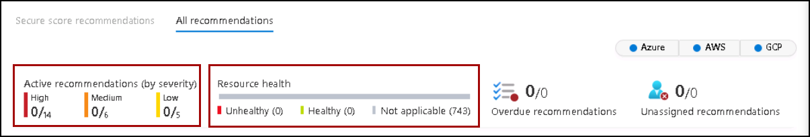
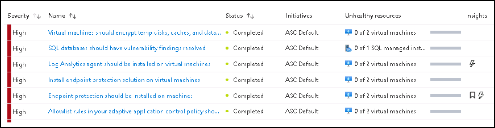
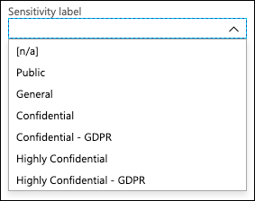
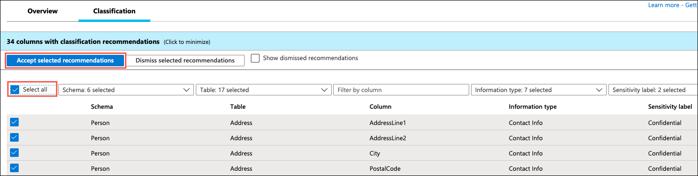

### Task 1: Review the already enabled Security of Microsoft Defender for Cloud.

1. Search and select **SQL Managed instance** from the Azure search bar.
    
    

1. Select your **Managed instance**.

    
    
1. Under the Security, select **Microsoft Defender for Cloud**.
    
    
    
1. At the top of the page click on the **Configure** link next to the Azure Defender for SQL: Enabled at the server-level header.

    
        
1. Under the VULNERABILITY ASSESSMENT SETTINGS, check your **Subscription** and check defender is linked to a **Storage account**.

    
    
1. Click on **Save**.
    
1. Navigate back to Microsoft defender for cloud and Click on **View all recommendations in Defender for Cloud**.

    

1. On the Recommendation page, pay attention to the first part of the page; the summary view. It includes the current progress on the **Recommendations status** (both completed security controls and recommendations), and **Resource health** (by severity).

    

1. From the top menu, click on the **Download CSV report** button – this allows you to get a snapshot of your resources, their health status, and the associated            recommendations. You can use this file for pivoting and reporting.

    
    
1. On the resource pane, review the virtual machine information alongside the recommendation list.

    
    
1. To view the recommendation, search and select **Machines should have a vulnerability assessment solution**.

    
    
    
1. Click to expand **Remediation steps (1)** – then click on the **Quick fix logic (2)** option to expose an automatic remediation script content (ARM template). Once    done, **Close (3)** this window. 

    
    
1. From the Affected resources tab, you will see **no Unhealthy resources** and **no Healthy resources** are there to fix because they all are already fix

    
    
    
### Task 2: Configure Data Discovery and Classification

1. Navigate to **SQLMI-Shared-RG** resource group and select the SQL Managed instance named **sqlmi--cus**. Now, from the **Overview** tab select the Managed database named **<inject key="Database Name" enableCopy="false"/>**.

1. On the <inject key="Database Name" enableCopy="false"/> Managed database blade, select **Data Discovery & Classification** from the left-hand menu.

   

1. In the **Data Discovery & Classification** blade, select the info link with the message **We have found 35 columns with classification recommendations**.

   
   
1. Look over the list of recommendations to get a better understanding of the types of data and classifications that can be assigned, based on the built-in classification settings. In the list of classification recommendations, select the recommendation for the **Sales - CreditCard - CardNumber** field.

   

1. Due to the risk of exposing credit card information, WWI would like a way to classify it as highly confidential, not just **Confidential**, as the recommendation suggests. To correct this, select **+ Add classification** at the top of the Data Discovery & Classification blade.

   

1. Quickly expand the **Sensitivity label** field and review the various built-in labels from which you can choose. You can also add custom labels, should you desire.

   

1. In the Add classification dialog, enter the following:

   - **Schema name**: Select **Sales**.
   - **Table name**: Select **CreditCard**.
   - **Column name**: Select **CardNumber (nvarchar)**.
   - **Information type**: Select **Credit Card**.
   - **Sensitivity level**: Select **Highly Confidential**.

   

1. Select **Add classification**.

1. Notice that the **Sales - CreditCard - CardNumber** field disappears from the recommendations list, and the number of recommendations drops by 1.

1. Select **Save** on the toolbar of the Data Classification window. It may take several minutes for the save to complete.

   

1. Other recommendations you can review are the **HumanResources - Employee** fields for **NationIDNumber** and **BirthDate**. Note that the recommendation service flagged these fields as **Confidential - GDPR**. WWI maintains data about gamers from around the world, including Europe, so having a tool that helps them discover data that may be relevant to GDPR compliance is very helpful.

    

1. Check the **Select all** checkbox at the top of the list to select all the remaining recommended classifications, and then select **Accept selected recommendations**.

    

1. Select **Save** on the toolbar of the Data Classification window. It may take several minutes for the save to complete.

    

1. When the save completes, select the **Overview** tab on the Data Discovery & Classification blade to view a report with a full summary of the database classification state.

    
