### Task 1: Review the already enabled Security of Microsoft Defender for Cloud.

1. Search and select **SQL Managed instance** from the Azure search bar.
    
    

1. Select your **Managed instance**.

    
    
1. Under the Security, select **Microsoft Defender for Cloud**.
    
    
    
1. At the top of the page click on the **Configure** link next to the Azure Defender for SQL: Enabled at the server-level header.

    
        
1. Under the VULNERABILITY ASSESSMENT SETTINGS, check your **Subscription** and check defender is linked to a **Storage account**.

    
    
1. Click on **Save**.
    
1. Navigate back to Microsoft defender for cloud and Click on **View all recommendations in Defender for Cloud**.

    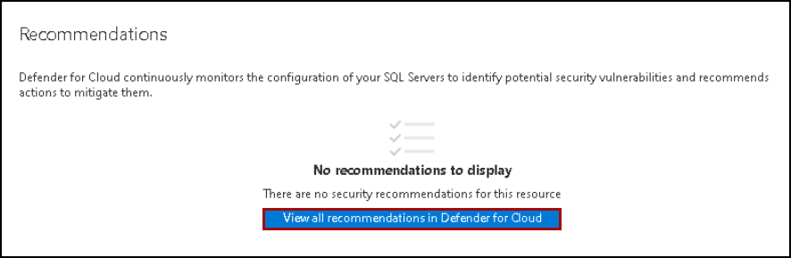


1. On the Recommendation page, pay attention to the first part of the page; the summary view. It includes the current progress on the **Recommendations status** (both completed security controls and recommendations), and **Resource health** (by severity).

    

1. From the top menu, click on the **Download CSV report** button – this allows you to get a snapshot of your resources, their health status, and the associated            recommendations. You can use this file for pivoting and reporting.

    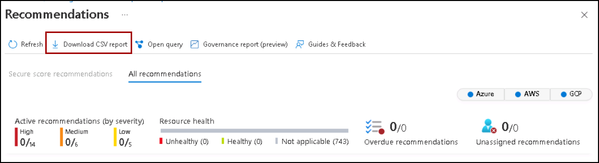
    
1. On the resource pane, review the virtual machine information alongside the recommendation list.

    
    
1. To view the recommendation, search and select **Machines should have a vulnerability assessment solution**.

    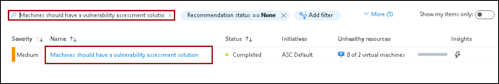
    
    
1. Click to expand **Remediation steps (1)** – then click on the **Quick fix logic (2)** option to expose an automatic remediation script content (ARM template). Once    done, **Close (3)** this window. 

    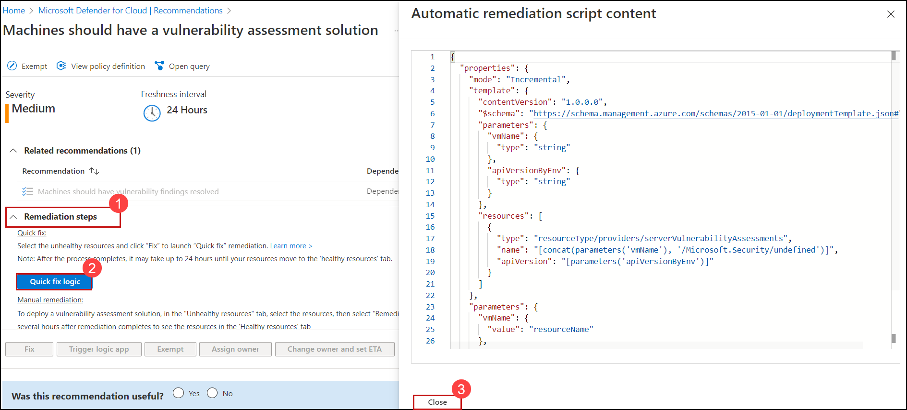
    
1. From the Affected resources tab, you will see **no Unhealthy resources** and **no Healthy resources** are there to fix because they all are already fix

    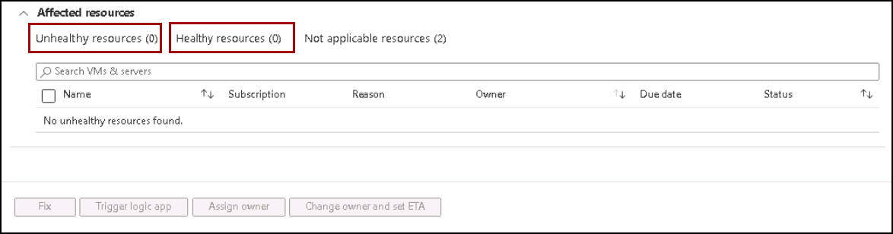
    
    
### Task 2: Configure Data Discovery and Classification

1. Navigate to **SQLMI-Shared-RG** resource group and select the SQL Managed instance named **sqlmi--cus**. Now, from the **Overview** tab select the Managed database named **<inject key="Database Name" enableCopy="false"/>**.

1. On the <inject key="Database Name" enableCopy="false"/> Managed database blade, select **Data Discovery & Classification** from the left-hand menu.

   

1. In the **Data Discovery & Classification** blade, select the info link with the message **We have found 35 columns with classification recommendations**.

   
   
1. Look over the list of recommendations to get a better understanding of the types of data and classifications that can be assigned, based on the built-in classification settings. In the list of classification recommendations, select the recommendation for the **Sales - CreditCard - CardNumber** field.

   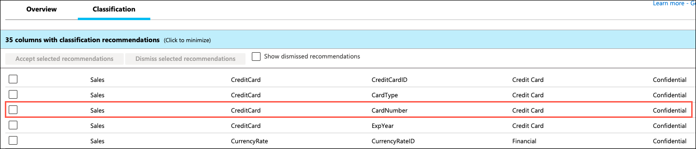

1. Due to the risk of exposing credit card information, WWI would like a way to classify it as highly confidential, not just **Confidential**, as the recommendation suggests. To correct this, select **+ Add classification** at the top of the Data Discovery & Classification blade.

   

1. Quickly expand the **Sensitivity label** field and review the various built-in labels from which you can choose. You can also add custom labels, should you desire.

   

1. In the Add classification dialog, enter the following:

   - **Schema name**: Select **Sales**.
   - **Table name**: Select **CreditCard**.
   - **Column name**: Select **CardNumber (nvarchar)**.
   - **Information type**: Select **Credit Card**.
   - **Sensitivity level**: Select **Highly Confidential**.

   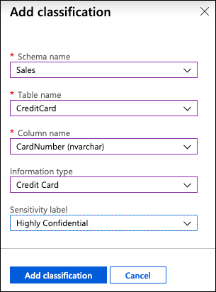

1. Select **Add classification**.

1. Notice that the **Sales - CreditCard - CardNumber** field disappears from the recommendations list, and the number of recommendations drops by 1.

1. Select **Save** on the toolbar of the Data Classification window. It may take several minutes for the save to complete.

   

1. Other recommendations you can review are the **HumanResources - Employee** fields for **NationIDNumber** and **BirthDate**. Note that the recommendation service flagged these fields as **Confidential - GDPR**. WWI maintains data about gamers from around the world, including Europe, so having a tool that helps them discover data that may be relevant to GDPR compliance is very helpful.

    

1. Check the **Select all** checkbox at the top of the list to select all the remaining recommended classifications, and then select **Accept selected recommendations**.

    

1. Select **Save** on the toolbar of the Data Classification window. It may take several minutes for the save to complete.

    

1. When the save completes, select the **Overview** tab on the Data Discovery & Classification blade to view a report with a full summary of the database classification state.

    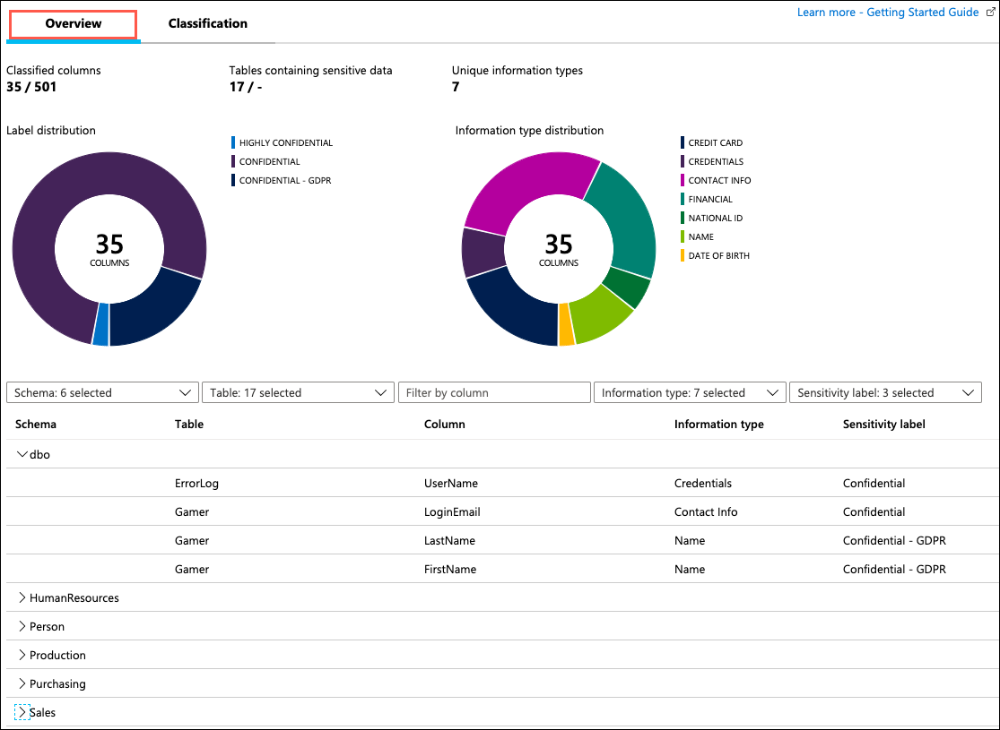
    
    
### Task 2: Review an Azure Defender for SQL Vulnerability Assessment

In this task, you review an assessment report generated by Azure Defender for the `WideWorldImporters` database and take action to remediate one of the findings in the `WideWorldImporters` database. The [SQL Vulnerability Assessment service](https://docs.microsoft.com/azure/sql-database/sql-vulnerability-assessment) is a service that provides visibility into your security state and includes actionable steps to resolve security issues and enhance your database security.

1. Select **Microsoft Defender for Cloud** from the left hand navigation menu of the **<inject key="Database Name" enableCopy="false"/>** Managed database.

1. On the **Microsoft Defender for Cloud** blade for the <inject key="Database Name" enableCopy="false"/> Managed database, Scroll down and click on **View additional findings in Vulnerability Assessment** to open the Vulnerability Assessment blade.

   

1. On the Vulnerability Assessment blade, select **Scan** on the toolbar.

   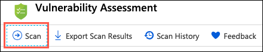

1. When the scan completes, a dashboard displaying the number of failing and passing checks, along with a breakdown of the risk summary by severity level is displayed.

   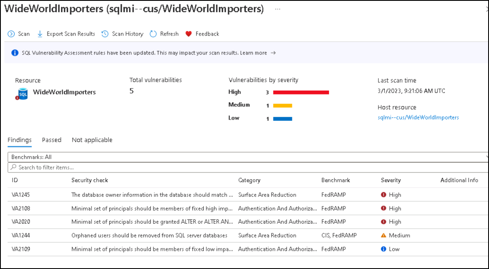

1. In the scan results, take a few minutes to browse both the Failed and Passed checks, and review the types of checks that are performed. In the **Unhealthy** the list, locate the security check for **Transparent data encryption**. This check has an ID of **VA1219**.

   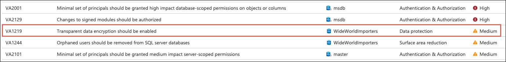

1. Select the **VA1219** finding to view the detailed description.

   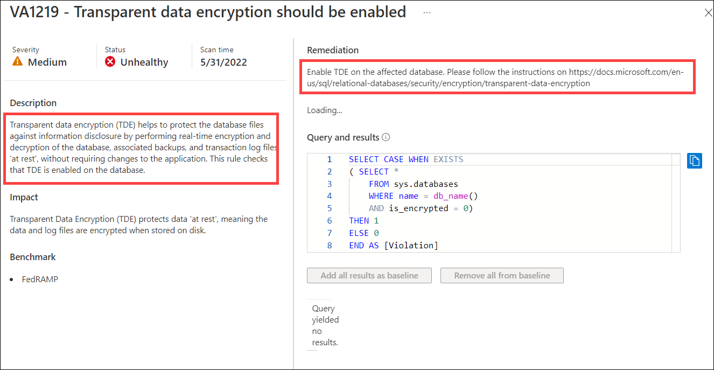

   > The details for each finding provide more insight into the reason for the finding. Of note are fields describing the finding, the impact of the recommended settings, and details on remediation for the finding.

1. You will now act on the recommended remediation steps for the finding and enable [Transparent Data Encryption](https://docs.microsoft.com/azure/azure-sql/database/transparent-data-encryption-tde-overview?tabs=azure-portal) for the `WideWorldImporters` database. To accomplish this, switch over to using SSMS on your JumpBox VM for the next few steps.

   > **Note**
   >
   > Transparent data encryption (TDE) needs to be manually enabled for Azure SQL Managed Instance. TDE helps protect Azure SQL Database, Azure SQL Managed Instance, and Azure Data Warehouse against the threat of malicious activity. It performs real-time encryption and decryption of the database, associated backups, and transaction log files at rest without requiring changes to the application.

1. On your JumpBox VM, open Microsoft SQL Server Management Studio 19 from the Start menu, and enter the following information in the **Connect to Server** dialog and click on **Connect**.

   - **Server name**: Enter the fully qualified domain name of your SQL managed instance, which you copied from the Azure Cloud Shell in a previous Exercise.
   - **Authentication**: Select **SQL Server Authentication**.
   - **Login**: Enter `contosoadmin`
   - **Password**: Enter `IAE5fAijit0w^rDM`
   - Check the **Remember password** box.

   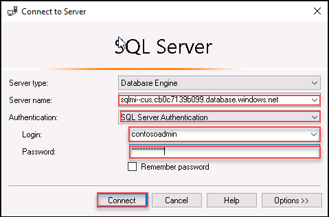

1. In SSMS, select **New Query** from the toolbar and paste the following SQL script into the new query window.

   ```sql
   USE WideWorldImporters;
   GO

   ALTER DATABASE [WideWorldImporters] SET ENCRYPTION ON
   ```

   > You turn transparent data encryption on and off on the database level. To enable transparent data encryption on a database in Azure SQL Managed Instance use must use T-SQL.

1. Select **Execute** from the SSMS toolbar. After a few seconds, you will see a message that "Commands completed successfully."

10. You can verify the encryption state and view information on the associated encryption keys by using the [sys.dm_database_encryption_keys view](https://docs.microsoft.com/sql/relational-databases/system-dynamic-management-views/sys-dm-database-encryption-keys-transact-sql). Select **New Query** on the SSMS toolbar again, and paste the following query into the new query window:

    ```sql
    SELECT * FROM sys.dm_database_encryption_keys
    ```

    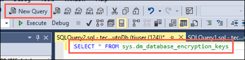

1. Select **Execute** from the SSMS toolbar. You will see two records in the Results window, which provide information about the encryption state and keys used for encryption.

    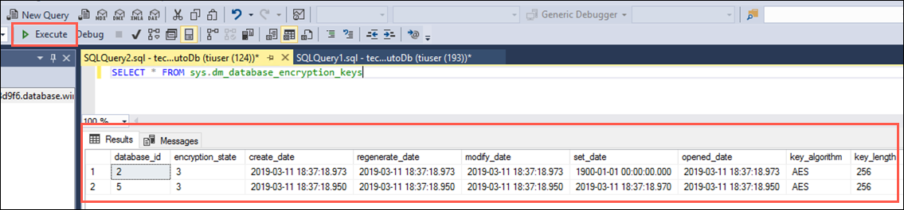

    > By default, service-managed transparent data encryption is used. A transparent data encryption certificate is automatically generated for the server that contains the database.

1. Return to the Azure portal and the Azure Defender for SQL's Vulnerability Assessment blade of the `WideWorldImportersSUFFIX` managed database. On the toolbar, select **Scan** to start a new assessment of the database.

    

1. When the scan completes, select the **Findings** tab, enter **VA1219** into the search filter box, and observe that the previous failure is no longer in the findings list.

    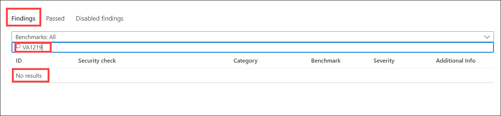

1. Now, select the **Passed** tab, and observe the **VA1219** check is listed with a status of **PASS**.

    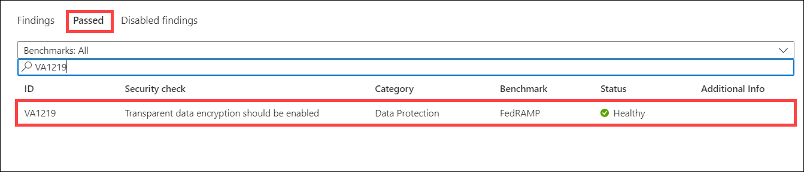

    > Using the SQL Vulnerability Assessment, it is simple to identify and remediate potential database vulnerabilities, allowing you to improve your database security proactively.
